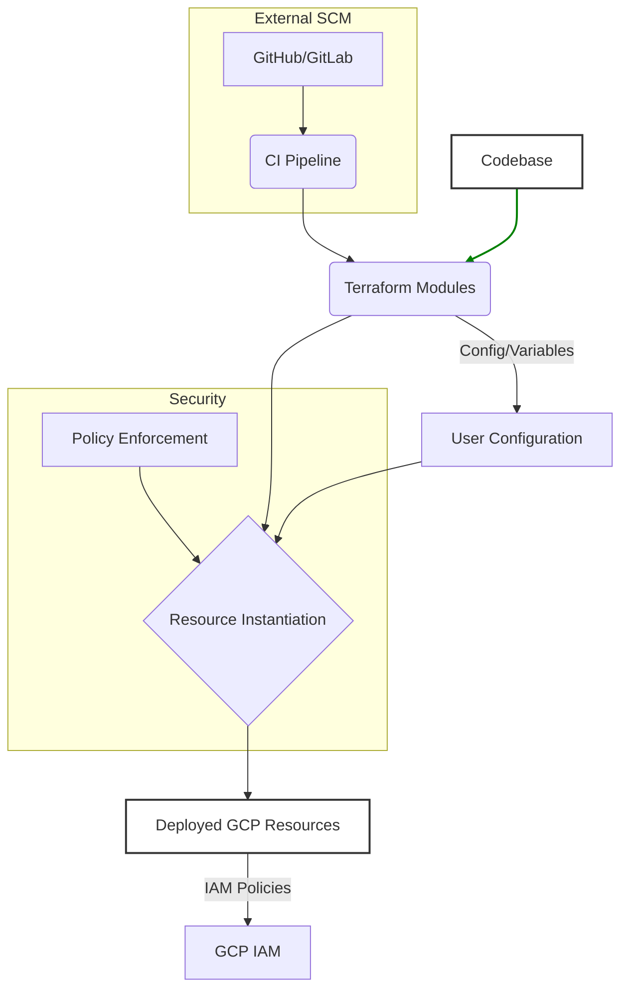

# Architecture Spine — Secure CI/CD Pipeline

## Design Paradigm

Modular Terraform Resource: The architecture is built around highly focused, composable Terraform modules that encapsulate specific sets of related cloud resources. This paradigm promotes reusability, clear ownership, and minimal abstraction over underlying provider resources.

## Invariants & Rules

### AD-1 — Module Boundary Enforcement

- **Binds:** `all`
- **Prevents:** The introduction of unrelated resources into a module, ensuring each module maintains a defined, narrow scope.
- **Rule:** Modules MUST only contain resources directly aligned with their defined functional purpose. Agents MUST NEVER introduce unrelated resources into a module; new resources MUST align with that module's defined scope.

### AD-2 — Terraform Version Compatibility

- **Binds:** `all`
- **Prevents:** Compatibility issues arising from newer Terraform features or syntax.
- **Rule:** All Terraform code MUST be fully compatible with Terraform versions up to 1.5.7 (inclusive). No features introduced in Terraform 1.6.0 or later are permitted.

### AD-3 — Cloud Foundation Toolkit (CFT) Preference

- **Binds:** `all`
- **Prevents:** Inconsistent resource provisioning and deviations from Google-recommended best practices.
- **Rule:** Always prioritize using Cloud Foundation Toolkit (CFT) modules over base `google` provider resources for common patterns.

### AD-4 — Terraform Module Version Pinning

- **Binds:** All module declarations
- **Prevents:** Unexpected breaking changes or regressions from upstream module updates.
- **Rule:** Module versions MUST be strictly pinned. For stable modules (v1+), use pessimistic constraint operators (e.g., `version = "~> 1.0"`). For pre-release modules (< v1), pin by minor version (e.g., `version = "~> 0.2.0"`).

### AD-5 — Resource Naming Collision Avoidance

- **Binds:** All deployable resources with potential for name collisions.
- **Prevents:** Naming conflicts in deployed Google Cloud resources.
- **Rule:** All resources that have ANY chance of name collision MUST include an optional `suffix` variable (type `string`, default `null`) in their deployed name. If `suffix` is not provided by the user, a random 4-character lowercase string (a-z) MUST be generated and used as the suffix.

### AD-6 — Atomic File Modification

- **Binds:** All automated file modifications within the repository.
- **Prevents:** Data loss, inconsistent state, or accidental overwrites during automated file operations.
- **Rule:** Agents MUST NEVER use shell redirection (`cat << EOF`, `echo "..." >`, `>>`, `tee`) to create, overwrite, or append to files. For creating new files, agents MUST ALWAYS use the `write_file` tool. For targeted edits or appending to a single file, agents MUST ALWAYS use the `replace` tool. Shell commands (like `sed -i`, `perl -pi`, or `find ... xargs sed`) MAY ONLY be used for regex-based or pattern-based replacements across multiple files where the exact-match `replace` tool is not feasible.

### AD-7 — Automated Integration Testing Lifecycle

- **Binds:** All Terraform modules, example deployments, and the CI/CD pipeline itself.
- **Prevents:** Deployment of non-functional, insecure, or non-compliant infrastructure; regressions in module behavior; and inconsistent testing practices.
- **Rule:** All Terraform modules and example deployments MUST be validated through an automated integration testing lifecycle executed in Cloud Build. Each test SHALL follow `init`, `apply`, `verify`, and `teardown` stages, using the `cft test run` framework to provision and inspect real GCP resources. Tests MUST cover functional correctness, security compliance (including policy enforcement from `/build/policies`), and network isolation. Test execution within Cloud Build is a mandatory step for merging PRs.

### AD-7 — Automated Integration Testing Lifecycle

- **Binds:** All Terraform modules, example deployments, and the CI/CD pipeline itself.
- **Prevents:** Deployment of non-functional, insecure, or non-compliant infrastructure; regressions in module behavior; and inconsistent testing practices.
- **Rule:** All Terraform modules and example deployments MUST be validated through an automated integration testing lifecycle executed in Cloud Build. Each test SHALL follow `init`, `apply`, `verify`, and `teardown` stages, using the `cft test run` framework to provision and inspect real GCP resources. Tests MUST cover functional correctness, security compliance (including policy enforcement from `/build/policies`), and network isolation. Test execution within Cloud Build is a mandatory step for merging PRs.



## Consistency Conventions

| Concern | Convention |
| --- | --- |
| Naming (entities, files, interfaces, events) | `snake_case` for all resources, modules, variables, and outputs. Avoid repeating resource type in resource names. Keep identifiers simple. |
| Data & formats (ids, dates, error shapes, envelopes) | Description fields for variables and outputs MUST include expected string format (e.g., "Expected format: `projects/{project}/regions/{region}/serviceAccounts/{email}`"). |
| State & cross-cutting (mutation, errors, logging, config, auth) | IAM policies are implemented within resources via standard interfaces (`_binding` or `_member` roles). Include optional `labels` variable (`map(string)`, default `{}`) into all resources supporting `labels` argument. |

## Stack

| Name | Version |
| --- | --- |
| Terraform | <= 1.5.7 |
| Python | 3.10+ |
| Docker Engine | Latest |
| Google Cloud SDK | Latest |
| `make` utility | Latest |

## Structural Seed

This architecture is based on the modular structure of Terraform modules within the repository. Key structural elements are reflected in the `modules/` directory.

```text
{project-root}/
  modules/ # Core, reusable Terraform modules
    attestor/ # Binary Authorization attestor module
    cloudbuild-private-pool/ # Dedicated Cloud Build private worker pool module
    secure-cd/ # Secure Continuous Deployment pipeline module
    secure-ci/ # Secure Continuous Integration pipeline module
    workerpool-gke-ha-vpn/ # VPN connectivity for worker pools
  examples/ # Working, end-to-end examples demonstrating module usage
  build/policies/ # Centralized policy definitions for security gates
```

## Deferred

*   **Detailed module internal structure:** The internal `main.tf`, `variables.tf`, `outputs.tf`, `locals.tf`, `iam.tf`, `versions.tf` structure within each module is well-defined in `AGENTS.md` and can be deferred to module-specific documentation. (Reason: already covered in `AGENTS.md`, not a high-level architectural invariant).
*   **Specific security policy content:** The exact content of policies in `build/policies/` is dynamic and subject to change; the architectural invariant is that policies are enforced from this location. (Reason: content detail is too granular for the architectural spine).
*   **User feedback mechanisms:** The process for gathering user feedback and incorporating it into the roadmap is an open question in the PRD and will be decided outside of the architectural spine. (Reason: falls under product management/roadmap, not core architecture).
*   **Compliance frameworks:** Specific compliance frameworks (e.g., HIPAA, PCI-DSS) that the pipeline needs to explicitly support are open questions in the PRD and will be addressed separately. (Reason: business/compliance requirement, not core architecture).
